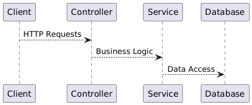

# EasyShop - an E-Commerce Web Application

## Overview
This project consists of an E-Commerce API (`easyshop` backend) and a client-side web application (`capstone-client-web-application`). Together, they provide functionality for managing users, products, categories, and more. The backend is built with Spring Boot, while the frontend is designed as a separate web application.

## Features

- **Authentication**: Secure user login with role-based access control (Admin/User) using JWT.
- **Category Management**: CRUD operations for product categories with admin-only access for create, update, and delete.
- **Product Management**: Full CRUD operations for products, with filtering by category, price range, and color.
- **User Profile Management**: Allows users to view and update their personal profile details securely.
- **Error Handling**: Provides clear error responses with appropriate HTTP status codes (e.g., 404, 401, 500).
- **API Testing**: Postman-compatible endpoints for testing CRUD operations and filters.

## Technologies Used
- **Backend**: Java, Spring Boot, Spring Security, Maven
- **Frontend**: `capstone-client-web-application` (HTML, CSS, JavaScript, Bootstrap)
- **Database**: MySQL
- **Testing**: Postman, JUnit

## Installation and Setup

### Prerequisites
- Java 17+
- Maven
- IntelliJ IDEA (for IDE setup)
- MySQL Server
- Node.js (for frontend if applicable)

# Diagram

This diagram represents the architecture of our E-Commerce API, specifically focusing on how the different components interact.

---

## **1. Client Layer**

- Represents the end-users or front-end applications interacting with the API.
- Sends **HTTP requests** to the API endpoints via web browsers, mobile apps, or Postman.

**Example**:
- A user fetches all products using `GET /products`.

---

## **2. Controller Layer**

- This layer handles incoming requests from the **Client** and maps them to appropriate business logic.
- Acts as the entry point into the backend system.

**Example**:
- The `ProductsController` processes a request to fetch products and calls the **Service/DAO Layer**.

---

## **3. Service/DAO Layer**

- The **Service** contains the core **business logic** of the application.
- Communicates with the **Database** through DAO (Data Access Object) classes to retrieve or update data.
- Ensures data integrity and implements rules like checking user permissions.

**Example**:
- The `ProductDao` fetches a list of products based on filters like price range and category.

---

## **4. Database Layer (MySQL)**

- Stores all persistent data for the application, such as user profiles, product details, categories, etc.
- Ensures relationships between entities are maintained, such as categories linked to products.

**Example**:
- A query fetches all products in a specific category.

## Testing

### Using Postman
1. Import the API collection into Postman or manually configure requests.
2. Use the JWT token retrieved from the `/auth/login` endpoint for testing secured routes.
3. Test various CRUD operations for categories, products, and profiles.

### API Endpoints
| Method | Endpoint             | Description                             | Access       |
|--------|----------------------|-----------------------------------------|--------------|
| POST   | `/auth/login`        | Log in a user and retrieve a JWT token. | Public       |
| GET    | `/categories`        | Retrieve all categories.                | Public       |
| GET    | `/categories/{id}`   | Retrieve a category by ID.              | Public       |
| POST   | `/categories`        | Add a new category.                     | Admin only   |
| PUT    | `/categories/{id}`   | Update an existing category.            | Admin only   |
| DELETE | `/categories/{id}`   | Delete a category by ID.                | Admin only   |
| GET    | `/products`          | Search for products using filters.      | Public       |
| GET    | `/products/{id}`     | Retrieve product details by ID.         | Public       |
| POST   | `/products`          | Add a new product.                      | Admin only   |
| PUT    | `/products/{id}`     | Update a product.                       | Admin only   |
| DELETE | `/products/{id}`     | Delete a product.                       | Admin only   |
| GET    | `/profile`           | Retrieve the profile of the logged-in user. | Logged-in Users |
| PUT    | `/profile`           | Update the profile of the logged-in user. | Logged-in Users |

### Sample Tests
1. Retrieve all products: **GET** `/products`.
2. Add a new category (Admin): **POST** `/categories`.
3. Update a product (Admin): **PUT** `/products/{id}`.
4. Delete a category (Admin): **DELETE** `/categories/{id}`.

## Future Enhancements
- **Shopping Cart**
  - Implement full shopping cart functionality where users can add, update, and remove products.
  - Include quantity adjustments and real-time stock validation.
  - Provide persistent storage for shopping cart items for logged-in users.
- **Checkout**
  - Develop a secure checkout process for users to place orders.
  - Integrate payment gateway options for seamless transactions.
  - Generate order confirmations and save order details for future reference.
  - Include address validation and shipping calculations.

## License
This project is licensed under the MIT License - see the LICENSE file for details.
